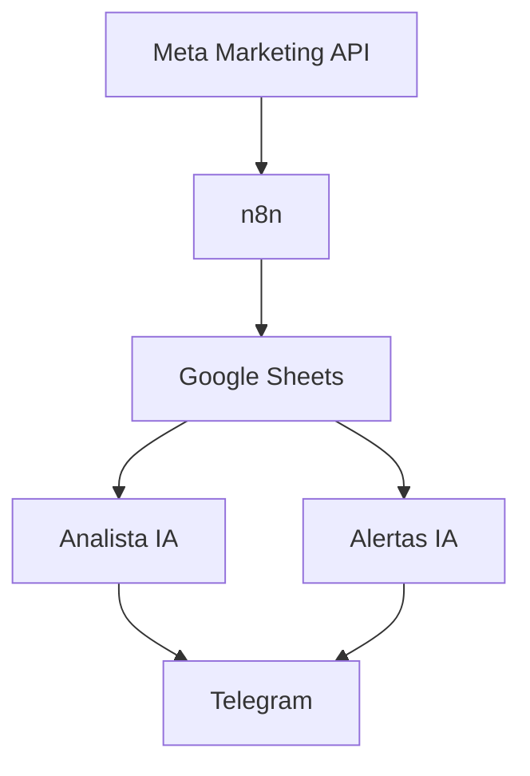
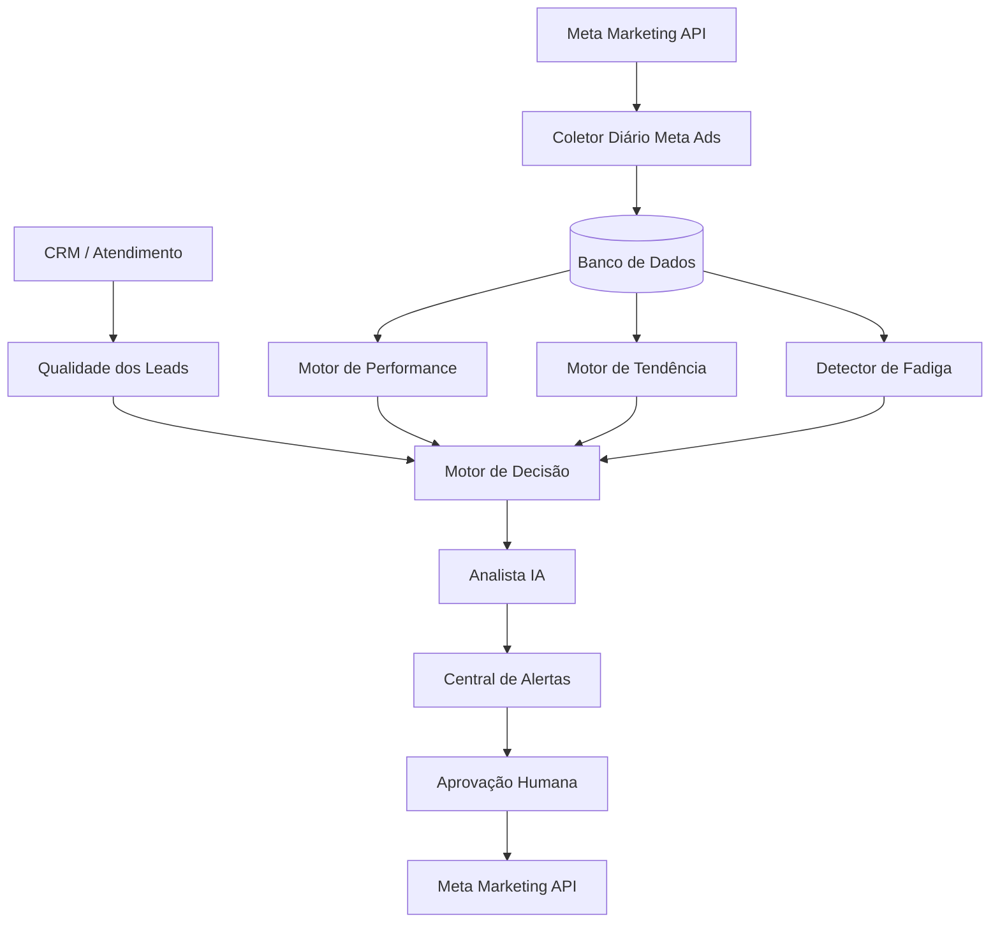

# Meta Ads Growth

Sistema de automação para coleta, análise, monitoramento e otimização de campanhas Meta Ads usando n8n, Meta Marketing API, inteligência artificial e dados do funil comercial.

O objetivo do projeto é evoluir os fluxos atuais de relatórios e alertas para um sistema de gestão de performance capaz de identificar desperdícios, encontrar oportunidades de escala, detectar fadiga de anúncios, medir qualidade dos leads e apoiar decisões de orçamento e criativos.

> Estado atual: fase de documentação e consolidação da base existente.

---

## Objetivo do produto

O Meta Ads Growth deve responder continuamente a cinco perguntas:

1. Onde a verba está sendo desperdiçada?
2. Quais campanhas, conjuntos e anúncios merecem mais investimento?
3. Quais criativos, ofertas e públicos estão perdendo desempenho?
4. Quais anúncios geram leads realmente qualificados, e não apenas conversas baratas?
5. Qual é a próxima ação recomendada para melhorar o resultado da conta?

O produto final não deverá apenas gerar relatórios. Ele deverá transformar dados em decisões práticas e rastreáveis.

---

## Princípio principal

Uma conversa barata não significa necessariamente um lead bom.

A evolução do sistema seguirá este funil:

```text
Impressão
   ↓
Clique
   ↓
Conversa
   ↓
Lead identificado
   ↓
Lead qualificado
   ↓
Agendamento
   ↓
Proposta
   ↓
Venda
```

O sistema deverá evoluir de métricas como **CPC** e **custo por conversa** para métricas de negócio como:

- custo por lead qualificado;
- custo por agendamento;
- custo por proposta;
- custo por venda;
- taxa de conversa para qualificação;
- taxa de qualificação para agendamento;
- taxa de agendamento para venda.

---

# Workflows existentes

A branch `main` representa a fotografia inicial do projeto antes da refatoração.

## 1. RELATORIOS CAMPANHAS META

Arquivo:

```text
RELATORIOS CAMPANHAS META.json
```

Responsável por consultar a Meta Marketing API nos níveis:

- campanha;
- conjunto de anúncios;
- anúncio.

Coleta atualmente métricas como:

- investimento;
- impressões;
- alcance;
- cliques;
- CTR;
- CPC;
- CPM;
- cliques no link;
- conversas iniciadas;
- primeiras respostas;
- conexões de mensagem;
- visualizações de vídeo;
- custo por conversa.

Os dados são normalizados e enviados para Google Sheets.

### Papel futuro

Este workflow será transformado no **coletor diário de dados Meta Ads**.

Ele deverá coletar dados em granularidade diária e armazená-los sem duplicidade.

---

## 2. ANALISTA DE ANUNCIOS

Arquivo:

```text
ANALISTA DE ANUNCIOS.json
```

Lê os dados de campanhas, conjuntos e anúncios armazenados no Google Sheets e prepara um relatório consolidado para análise por IA.

Atualmente calcula e compara informações como:

- investimento total;
- custo médio por conversa;
- CPC médio;
- CTR médio;
- CPM médio;
- melhores campanhas;
- piores campanhas;
- melhores conjuntos;
- piores conjuntos;
- melhores anúncios;
- piores anúncios;
- anúncios com gasto e nenhuma conversa.

A IA gera diagnóstico, recomendações de melhoria, sugestões de criativos, copy, CTA e novos testes.

### Papel futuro

A IA não deverá ser responsável pelos cálculos ou pelas regras principais de decisão.

O código calculará os indicadores e classificará a performance. A IA será utilizada principalmente para:

- interpretar resultados;
- explicar causas prováveis;
- gerar hipóteses;
- sugerir novos criativos;
- sugerir novas copies;
- resumir decisões para o gestor.

---

## 3. META ADS - ALERTAS

Arquivo:

```text
META ADS - ALERTAS.json
```

Analisa campanhas, conjuntos e anúncios e gera alertas curtos para tomada de decisão.

As ações atuais incluem recomendações como:

- escalar;
- manter;
- observar;
- ajustar copy;
- ajustar criativo;
- aumentar público;
- refinar público;
- reduzir orçamento;
- pausar;
- duplicar para teste;
- trocar objetivo;
- criar nova variação.

### Papel futuro

Será transformado em uma camada de alertas alimentada pelo **Motor de Decisão**.

A IA explicará a decisão, mas os critérios de escala, pausa ou observação serão definidos matematicamente.

---

## 4. ALERTA FUNDOS META

Arquivo:

```text
ALERTA FUNDOS META.json
```

Consulta informações operacionais da conta de anúncios, incluindo:

- status da conta;
- limite;
- valor gasto;
- saldo disponível estimado;
- valores em aberto.

### Papel futuro

Será mantido como monitor operacional da conta e poderá gerar alertas automáticos de risco financeiro ou interrupção das campanhas.

---

## 5. TERMOMETRO_CAMPANHA

Arquivo:

```text
TERMOMETRO_CAMPANHA.json
```

Protótipo de monitoramento periódico de campanhas.

O fluxo contém conceitos que poderão ser reaproveitados na arquitetura futura, como:

- execução periódica;
- cadastro de clientes no Notion;
- metas configuráveis pelo Google Sheets;
- processamento cliente por cliente;
- consulta de métricas da Meta;
- comparação entre CPL real e CPL meta;
- diagnóstico automatizado;
- alertas.

Este workflow será tratado como **protótipo experimental** até que seus conceitos sejam incorporados à arquitetura principal.

---

# Problemas conhecidos da versão inicial

Estes pontos devem ser corrigidos antes de automatizar decisões de orçamento.

## 1. Períodos sobrepostos no histórico

O coletor atual consulta uma janela móvel de aproximadamente 180 dias e depois adiciona os dados novamente ao Google Sheets.

Isso pode gerar períodos repetidos e distorcer:

- investimento total;
- médias;
- rankings;
- custo por conversa;
- decisões de escala ou pausa.

### Solução planejada

Coletar preferencialmente **um dia por execução** e utilizar uma chave única para impedir duplicidade.

Exemplo:

```text
data + conta + nivel + id_objeto
```

No nível de anúncio:

```text
data + ad_id
```

---

## 2. Mapeamento incorreto de CPC em conjuntos

Na versão inicial existe um ponto em que a coluna `CPC` do nível de conjunto recebe o valor de `LEADS`.

### Correção

Deverá utilizar:

```text
$json.CPC
```

Essa correção será realizada na primeira etapa de refatoração.

---

## 3. Lead e conversa representam atualmente o mesmo evento

Na estrutura inicial, para campanhas de mensagens:

```text
LEADS = CONVERSAS INICIADAS
```

Consequentemente, CPL e custo por conversa podem representar essencialmente a mesma métrica.

### Solução planejada

Separar os eventos do funil comercial:

```text
conversa
lead_identificado
lead_qualificado
agendamento
proposta
venda
```

---

## 4. Falta de análise de tendência

Uma média histórica isolada pode esconder deterioração recente.

O sistema deverá comparar janelas móveis como:

```text
3 dias
7 dias
14 dias
30 dias
```

Exemplo de indicadores futuros:

```text
CTR 3d vs 7d
CTR 7d vs 14d
CPC 3d vs 7d
Custo por conversa 3d vs 7d
Custo por lead qualificado 7d vs 30d
```

---

# Arquitetura atual



---

# Arquitetura alvo



---

# Roadmap

## Fase 0 — Base e versionamento

Status: em andamento.

- [x] Criar repositório GitHub.
- [x] Salvar workflows existentes.
- [x] Criar documentação inicial.
- [x] Definir padrão de nomes dos nodes.
- [x] Definir padrão de comentários em código.
- [ ] Criar branch de desenvolvimento.

---

## Fase 1 — Corrigir a coleta de dados

Objetivo: criar uma base histórica confiável.

- [ ] Corrigir mapeamento de CPC dos conjuntos.
- [ ] Remover risco de períodos históricos duplicados.
- [ ] Definir coleta diária.
- [ ] Criar chave única para cada registro.
- [ ] Definir banco principal de métricas.
- [ ] Avaliar migração do histórico principal para Supabase/PostgreSQL.
- [ ] Manter Google Sheets como camada opcional de visualização/exportação.
- [ ] Padronizar datas em `America/Sao_Paulo`.

---

## Fase 2 — Motor de Performance

Objetivo: calcular métricas de forma determinística antes da IA.

Criar indicadores como:

- [ ] custo por conversa;
- [ ] CTR;
- [ ] CTR de link;
- [ ] CPC;
- [ ] CPM;
- [ ] taxa clique → conversa;
- [ ] frequência;
- [ ] velocidade de gasto;
- [ ] comparação com média da conta;
- [ ] score de performance.

---

## Fase 3 — Tendência e Fadiga

Objetivo: identificar quando um anúncio começa a perder eficiência.

- [ ] Comparar janelas de 3 dias.
- [ ] Comparar janelas de 7 dias.
- [ ] Comparar janelas de 14 dias.
- [ ] Comparar janelas de 30 dias.
- [ ] Detectar queda de CTR.
- [ ] Detectar aumento de CPC.
- [ ] Detectar aumento de custo por conversa.
- [ ] Detectar aumento de frequência.
- [ ] Criar score de fadiga.

---

## Fase 4 — Qualidade dos Leads

Objetivo: parar de otimizar apenas para conversa barata.

Integrar dados do atendimento/CRM para identificar:

- [ ] conversa iniciada;
- [ ] lead identificado;
- [ ] lead qualificado;
- [ ] agendamento;
- [ ] proposta;
- [ ] venda.

Novas métricas:

- [ ] custo por lead qualificado;
- [ ] custo por agendamento;
- [ ] custo por proposta;
- [ ] custo por venda;
- [ ] taxa de qualificação por anúncio;
- [ ] taxa de conversão por campanha.

---

## Fase 5 — Motor de Decisão

Objetivo: substituir critérios subjetivos por regras matemáticas.

Exemplo de índice:

```text
indice_custo = custo_anuncio / custo_medio_conta
```

Classificação inicial a ser validada com dados reais:

```text
<= 0,70      excelente
0,71 - 0,90  bom
0,91 - 1,10  normal
1,11 - 1,30  atenção
> 1,30       ruim
```

As decisões também deverão considerar volume mínimo e tempo de coleta.

Exemplo:

```text
bom custo
+ volume mínimo
+ histórico suficiente
+ qualidade acima da média
= candidato a escala
```

Nenhuma regra crítica deverá depender apenas da interpretação da IA.

---

## Fase 6 — Central de Alertas e Ações

Objetivo: transformar diagnóstico em ação operacional.

Alertas possíveis:

```text
ESCALAR
MANTER
OBSERVAR
REDUZIR ORÇAMENTO
PAUSAR
AJUSTAR COPY
AJUSTAR CRIATIVO
CRIAR NOVA VARIAÇÃO
```

Primeira versão:

```text
Sistema recomenda
      ↓
Gestor aprova
      ↓
n8n executa
      ↓
Meta Marketing API
```

Alterações automáticas de orçamento só serão implementadas depois que a base de dados e o motor de decisão estiverem validados.

---

## Fase 7 — Laboratório de Testes

Objetivo: registrar hipóteses e descobrir padrões vencedores.

Cada teste deverá registrar elementos como:

```text
gancho
oferta
criativo
formato
CTA
público
campanha
resultado
```

Exemplo:

```text
gancho: parcela
oferta: entrada facilitada
formato: vídeo curto
CTA: simular agora
```

O sistema poderá posteriormente identificar quais combinações geram melhor qualidade de lead.

---

## Fase 8 — Inteligência de Criativos

Objetivo: usar o histórico real da conta para gerar novas hipóteses.

A IA poderá aprender padrões como:

```text
Gancho A → CTR alto
Gancho B → mais conversas
Gancho C → mais leads qualificados
Criativo D → menor custo por qualificado
```

Novos anúncios deverão ser criados a partir de hipóteses mensuráveis, e não apenas de geração aleatória de texto.

---

## Fase 9 — Multi-cliente

Objetivo: permitir que a arquitetura funcione com várias contas de anúncios.

- [ ] Cadastro de clientes.
- [ ] Conta Meta por cliente.
- [ ] Metas individuais.
- [ ] CPL alvo individual.
- [ ] Regras individualizadas.
- [ ] Credenciais isoladas.
- [ ] Relatórios por cliente.
- [ ] Alertas por cliente.

Os conceitos presentes no workflow `TERMOMETRO_CAMPANHA.json` poderão servir como referência nesta fase.

---

# Padrão obrigatório para nodes n8n

Todos os nodes deverão possuir nomes em **português claro e descritivo**.

Evitar:

```text
Code1
Merge2
HTTP Request3
Set4
IF5
```

Preferir:

```text
BUSCA CAMPANHAS META
NORMALIZA DADOS DOS ANÚNCIOS
CALCULA MÉTRICAS DE PERFORMANCE
COMPARA PERÍODO DE 7 DIAS
VERIFICA FADIGA DO ANÚNCIO
ENVIA ALERTA NO TELEGRAM
```

O nome do node deve permitir entender sua função sem precisar abri-lo.

---

# Padrão obrigatório para código

O código deve priorizar legibilidade.

## Variáveis

Preferir nomes claros:

```javascript
const investimento = 100;
const conversasIniciadas = 12;
const custoMedioConta = 8.50;
```

Evitar abreviações sem necessidade:

```javascript
const inv = 100;
const conv = 12;
const cmc = 8.50;
```

## Funções

Exemplo:

```javascript
// Calcula quanto foi gasto para gerar cada conversa.
// Retorna null quando ainda não existem conversas.
function calcularCustoPorConversa(investimento, conversas) {
  if (conversas <= 0) {
    return null;
  }

  return investimento / conversas;
}
```

## Comentários

Os comentários devem ser breves e explicar principalmente:

- o objetivo de uma etapa importante;
- uma regra de negócio;
- o motivo de uma decisão não óbvia.

Evitar comentar cada linha do código.

Exemplo:

```javascript
// Compara o anúncio com a média da conta para gerar um índice relativo.
const indiceCusto = custoAnuncio / custoMedioConta;
```

---

# Convenção para nomes de workflows

Os novos workflows deverão seguir uma sequência lógica.

Exemplo inicial:

```text
META ADS | 01 | COLETA DE DADOS
META ADS | 02 | PROCESSA MÉTRICAS
META ADS | 03 | ANALISA PERFORMANCE
META ADS | 04 | GERA ALERTAS
META ADS | 05 | MONITORA ORÇAMENTO
META ADS | 06 | QUALIDADE DOS LEADS
META ADS | 07 | DETECTA FADIGA
META ADS | 08 | GERENCIA TESTES
META ADS | 09 | MOTOR DE DECISÃO
META ADS | 10 | EXECUTA AÇÕES
```

---

# Estratégia de Git

## `main`

Representa a versão estável/documentada do projeto.

Não deverá receber alterações experimentais diretamente.

## `desenvolvimento`

Branch usada para integrar a próxima geração dos workflows antes de chegar à `main`.

## Branches de funcionalidade

Quando necessário, poderão ser criadas branches específicas a partir de `desenvolvimento`.

Exemplos:

```text
feat/coleta-diaria
feat/motor-performance
feat/fadiga-criativos
feat/qualidade-leads
fix/cpc-conjuntos
```

Fluxo esperado:

```text
feature/fix
    ↓
desenvolvimento
    ↓
Pull Request
    ↓
main
```

---

# Commits

Preferir mensagens curtas e descritivas.

Exemplos:

```text
fix: corrige CPC dos conjuntos
feat: adiciona coleta diária de anúncios
feat: cria cálculo de tendência de 7 dias
docs: atualiza arquitetura do projeto
refactor: separa cálculo de métricas da análise por IA
```

---

# Segurança

Este repositório é público.

Nunca versionar:

- access tokens da Meta;
- chaves de API;
- senhas;
- secrets;
- URLs contendo tokens;
- credenciais de banco;
- dados pessoais de clientes;
- números de telefone de leads;
- dados sensíveis do CRM.

Os workflows devem utilizar credenciais configuradas no n8n e variáveis de ambiente sempre que possível.

---

# Regra para automações críticas

Durante as primeiras versões, o sistema poderá **recomendar** alterações, mas não deverá alterar automaticamente orçamento, status de campanhas ou anúncios sem uma etapa explícita de aprovação.

A automação completa só deverá ser habilitada quando:

1. a coleta estiver validada;
2. o histórico estiver livre de duplicidade;
3. as métricas estiverem validadas;
4. o motor de decisão estiver testado;
5. existir histórico suficiente para avaliar falsos positivos.

---

# Próxima etapa

A primeira etapa técnica da branch `desenvolvimento` será reconstruir a camada de coleta.

Prioridade:

```text
1. corrigir CPC dos conjuntos
2. substituir histórico sobreposto por coleta diária
3. definir armazenamento sem duplicidade
4. preparar métricas de 3, 7, 14 e 30 dias
5. separar conversa de lead qualificado
```

Somente depois dessa fundação o projeto avançará para decisões automáticas de escala, pausa, público, orçamento e criativos.

---

## Tecnologias previstas

- n8n
- Meta Marketing API
- Supabase / PostgreSQL
- Google Sheets
- Notion
- Telegram / WhatsApp
- APIs de modelos de linguagem
- GitHub

---

## Status

Projeto em desenvolvimento.

A `main` mantém a base inicial e o histórico dos workflows existentes. As próximas implementações serão desenvolvidas em branches separadas e integradas por Pull Request.